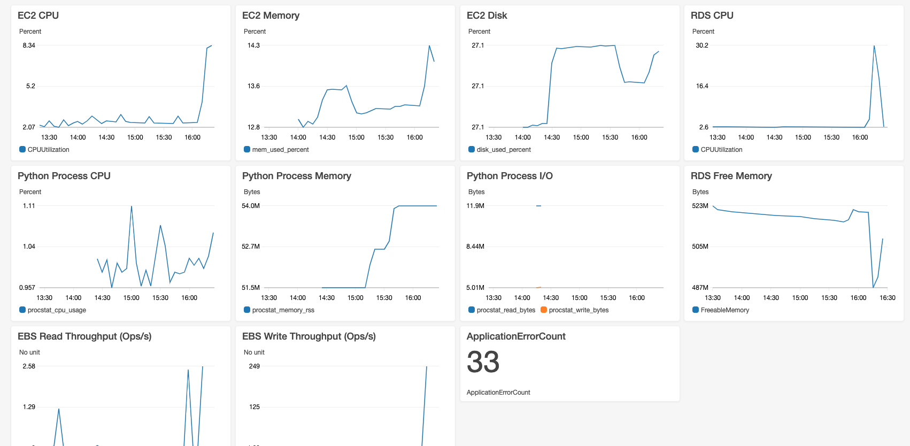

# CloudWatch

## Lab Overview

1. Route53 Health Check 생성

2. Application 로그를 CloudWatch Logs로 전송

3. AWS에서 기본적으로 제공하는 서비스별 Metric 리뷰

4. Custom Metric 생성

5. CloudWatch Alarm 생성

6. CloudWatch Dashboard 생성

## 시작하기전에

1. 본 Hands-on lab은 AWS Seoul region 기준으로 작성되었습니다. Region을 Seoul (ap-northeast-2)로 변경 후 진행 부탁드립니다.
2. [AWS Credit 추가하기](https://aws.amazon.com/ko/premiumsupport/knowledge-center/add-aws-promotional-code/)
3. [Lab 환경 구축](https://ap-northeast-2.console.aws.amazon.com/cloudformation/home?region=ap-northeast-2#/stacks/quickcreate?templateURL=https://saltware-aws-lab.s3.ap-northeast-2.amazonaws.com/cw/lab.yml&stackName=cw-lab)

## Route53 health check

1. 웹 브라우저에서 EC2 인스턴스 Public IP로 접속 후 "OK"가 웹 페이지에 보여지는지 확인

2. AWS Management Console에서 좌측 상단에 있는 **[Services]** 를 선택하고 검색창에서 Route53를 검색하거나 **[Networking & Content Delivery]** 밑에 있는 **[Route53]** 를 선택

3. Route53 Console에서 **[Health checks]**  &rightarrow; **[Create health check]** &rightarrow; **Name** = cw-lab, **IP address** = <EC2_PUBLIC_IP> 입력 후 **[Next]**

4. **Create alarm** = Yes, **Send notification to** = New SNS topic, **Topic name** = infra-monitoring , **Recipient email addresses** = [Your email address] &rightarrow; **[Create health check]**

5. AWS Notification - Subscription Confirmation 메일 수신후 Confirm

6. 5 ~ 10분정도 기다린 후 알람이 발생할 경우 웹페이지 접속시도

## CloudWatch Logs

1. EC2 Console에서 *cw-app* 인스턴스를 선택 &rightarrow; **[Connect]** &rightarrow; :radio_button: Session Manager &rightarrow; **[Connect]**

    - Root 환경으로 전환

        ```bash
        sudo -i
        ```

    - Application 로그 확인

        ```bash
        tail -100 /home/ec2-user/web-app/app.log
        ```

2. CloudWatch Logs 에이전트 설정

    - Yum package 업데이트

        ```bash
        sudo yum update -y
        ```

    - awslogs package 설치

        ```bash
        sudo yum install -y awslogs
        ```

    - Text editor로 */etc/awslogs/awscli.conf* 파일을 열고 아래와 같이 수정

        ```text
        [plugins]
        cwlogs = cwlogs
        [default]
        region = ap-northeast-2
        ```

    - Text editor로 */etc/awslogs/awslogs.conf* 파일을 열고 아래 설정을 추가

        ```text
        [cw-app/access_log]
        log_group_name = cw-app
        log_stream_name = {instance_id}_{ip_address}_access
        datetime_format = [%d/%b/%Y:%H:%M:%S %z]
        file = /home/ec2-user/web-app/app.log
        buffer_duration = 5000
        initial_position = start_of_file
        ```

    - awslogs 서비스 시작

        ```bash
        sudo systemctl start awslogsd
        ```

    - 부팅시 awslogs 시작하도록 설정 (Optional)

        ```bash
        sudo systemctl enable awslogsd.service
        ```

3. AWS Management Console에서 좌측 상단에 있는 **[Services]** 를 선택하고 검색창에서 CloudWatch를 검색하거나 **[Management & Governance]** 밑에 있는 **[CloudWatch]** 를 선택

4. CloudWatch Console에서 **[Logs]** 섹션 아래에 있는 **[Log groups]** 클릭 &rightarrow; *cw-app* 선택 &rightarrow; 해당 EC2 인스턴스의 ID 및 IP주소로 된 Log Stream 선택

5. 주기적으로 :arrows_counterclockwise: 버튼을 클릭하면서 실시간으로 어플리케이션 로그가 전송되는지 확인

## CloudWatch Metrics

1. 해당 어플리케이션은 EC2의 CPU, RAM, I/O 사용량이 높을때 또는 RDS의 CPU 사용량이 높을때 **Internal Server Error**를 발생합니다. CloudWatch Logs에 전송된 로그를 기반으로 관련된 EC2 / RDS Metric들을 확인

2. EC2 Console에서 *cw-app*를 선택하고 화면 아래에서 **Monitoring** 탭 선택

3. *CPU Utilization (Percent)* 지표를 선택후 **Time Range** 값을 *Last 3 Hours*로 변경하고 지난 3시간동안의 CPU 사용량 변화 확인

4. Disk 관련 Metric들의 값을 전부 0으로 되어있는데 Disk 읽기 쓰기가 없습니까?

    > CloudWatch Metrics는 *Namespace*로 구분되어집니다 `AWS/EC2`, `AWS/RDS` 이런식으로. `AWS/EC2` 네임스페이스에 있는 Disk 관련 Metric들은 Instance Store Volume에 대한 Metric입니다. EBS 볼륨을 사용할 경우 `AWS/EBS` 네임스페이스에서 Metric들을 확인해야 합니다

5. **Description** 탭으로 이동후 *Block devices*에 있는 **/dev/xvda** 클릭 후 *EBS ID*에 있는 **vol-xxxxxxxxxx** 클릭 &rightarrow; 화면 아래에서 **Monitoring** 탭 선택

6. **Showing data for** 값을 *Last 3 Hours*로 변경하고 지난 3시간동안의 Disk 사용량 변화 확인

7. AWS Management Console에서 좌측 상단에 있는 **[Services]** 를 선택하고 검색창에서 RDS를 검색하거나 **[Database]** 바로 밑에 있는 **[RDS]** 를 선택

8. RDS Console에서 **[Databases]** &rightarrow; *cw-postgres* &rightarrow; **[Monitorinig]** 으로 이동 후 해당 RDS 인스턴스에 대한 CPU, Memory, Storage, IO에 대한 지표 확인

## Custom Metrics

### Custom Script 사용

1. [AWS 공식가이드](https://docs.aws.amazon.com/AWSEC2/latest/UserGuide/mon-scripts.html)를 참고해서 EC2 인스턴스의 메모리 및 디스크 사용량 지표 구성

    - Package 설치

        ```bash
        sudo yum install -y perl-Switch perl-DateTime perl-Sys-Syslog perl-LWP-Protocol-https perl-Digest-SHA.x86_64
        ```

    - Monitoring 스크립트 설정

        ```bash
        curl https://aws-cloudwatch.s3.amazonaws.com/downloads/CloudWatchMonitoringScripts-1.2.2.zip -O
        ```

        ```bash
        unzip CloudWatchMonitoringScripts-1.2.2.zip && \
        rm CloudWatchMonitoringScripts-1.2.2.zip && \
        cd aws-scripts-mon
        ```

    - Crontab 에디터 실행후 아래의 script 붙여넣기

        ```bash
        crontab -e
        ```

        ```bash
        */5 * * * * ~/aws-scripts-mon/mon-put-instance-data.pl --mem-used-incl-cache-buff --mem-util --disk-space-util --disk-path=/ --from-cron
        ```

2. CloudWatch Console에서 **[Metrics]** 선택 &rightarrow; *Custom Namespaces* 아래 **Linux System** 선택 &rightarrow; DiskSpaceUtilization과 MemoryUtilization 지표를 확인

### CloudWatch Agent 사용

1. CloudWatch Agent 설치

    - Package 다운로드

        ```bash
        wget https://s3.amazonaws.com/amazoncloudwatch-agent/amazon_linux/amd64/latest/amazon-cloudwatch-agent.rpm
        ```

    - Package 설치

        ```bash
        sudo rpm -U ./amazon-cloudwatch-agent.rpm
        ```

2. EC2 인스턴스에 연결된 IAM Role에 **CloudWatchAgentServerPolicy** IAM Policy 추가

3. CloudWatch Agent configuration 파일 생성

    ```bash
    sudo vi /opt/aws/amazon-cloudwatch-agent/etc/amazon-cloudwatch-agent.json
    ```

    ```json
    {
        "agent":{
            "metrics_collection_interval":60,
            "run_as_user":"root"
        },
        "metrics":{
            "append_dimensions":{
                "AutoScalingGroupName":"${aws:AutoScalingGroupName}",
                "ImageId":"${aws:ImageId}",
                "InstanceId":"${aws:InstanceId}",
                "InstanceType":"${aws:InstanceType}"
            },
            "metrics_collected":{
                "disk":{
                    "measurement":[
                        "used_percent"
                    ],
                    "metrics_collection_interval":60,
                    "resources":[
                        "*"
                    ]
                },
                "mem":{
                    "measurement":[
                        "mem_used_percent"
                    ],
                    "metrics_collection_interval":60
                }
            }
        }
    }
    ```

4. CloudWatch Agent 실행

    ```bash
    sudo /opt/aws/amazon-cloudwatch-agent/bin/amazon-cloudwatch-agent-ctl -a fetch-config -m ec2 -c file:/opt/aws/amazon-cloudwatch-agent/etc/amazon-cloudwatch-agent.json -s
    ```

5. CloudWatch Console에서 **[Metrics]** 선택 &rightarrow; *Custom Namespaces* 아래 **CWAgent** 선택 &rightarrow; Disk 및 Memory 관련 지표를 확인

### Process 모니터링

1. CloudWatch Agent configuration 파일 생성

    ```bash
    sudo vi /opt/aws/amazon-cloudwatch-agent/etc/amazon-cloudwatch-agent.json
    ```

    ```json
    {
        "agent":{
            "metrics_collection_interval":60,
            "run_as_user":"root"
        },
        "metrics":{
            "append_dimensions":{
                "AutoScalingGroupName":"${aws:AutoScalingGroupName}",
                "ImageId":"${aws:ImageId}",
                "InstanceId":"${aws:InstanceId}",
                "InstanceType":"${aws:InstanceType}"
            },
            "aggregation_dimensions" : [["AutoScalingGroupName"]],
            "metrics_collected":{
                "disk":{
                    "measurement":[
                        "used_percent"
                    ],
                    "metrics_collection_interval":60,
                    "resources":[
                        "*"
                    ]
                },
                "mem":{
                    "measurement":[
                        "mem_used_percent"
                    ],
                    "metrics_collection_interval":60
                },
                "procstat": [
                    {
                        "pattern": ".*",
                        "measurement": [
                            "cpu_usage",
                            "memory_rss",
                            "read_bytes",
                            "write_bytes"
                        ]
                    }
                ]
            }
        }
    }
    ```

2. CloudWatch Agent 재시작

    ```bash
    sudo /opt/aws/amazon-cloudwatch-agent/bin/amazon-cloudwatch-agent-ctl -a fetch-config -m ec2 -c file:/opt/aws/amazon-cloudwatch-agent/etc/amazon-cloudwatch-agent.json -s
    ```

3. CloudWatch Console에서 **[Metrics]** 선택 &rightarrow; *Custom Namespaces* 아래 **CWAgent** 선택 &rightarrow; 현재 실행중인 프로세스들에 대한 CPU, Memory, I/O 에 대한 지표 확인

### CloudWatch Logs Metric Filter

1. CloudWatch Console에서 **[Logs]** 섹션 아래에 있는 **[Log groups]** 클릭 &rightarrow; :radio_button: *cw-app* 선택 &rightarrow; **[Create Metric Filter]**

2. **Filter Patten**에 "SystemError:" 입력 (" " 포함해서 입력) &rightarrow; **[Assign Metric]**

3. **Filter Name** = SystemError, **Metric Namespace** = *Create new namespace* 선택 후 MyApp 입력, **Metric Name** = ApplicationErrorAccount &rightarrow; **[Create Filter]**

4. CloudWatch Console에서 **[Metrics]** 선택 &rightarrow; *Custom Namespaces* 아래 **MyApp** 선택 &rightarrow; ApplicationErrorCount 지표를 선택 &rightarrow; **Graphed metrics** 탭으로 이동 &rightarrow; **Statistic** 값을 *Sum* 으로 **Period** 값을 *1 Minute*으로 변경해서 분당 에러 발생횟수 확인

## CloudWatch Alarm 설정

1. CloudWatch Console에서 **[Alarms]** 선택 &rightarrow; **[Create alarm]**

2. **[Select metric]** &rightarrow; *AWS Namespaces* 아래 **RDS** 선택 &rightarrow; **[Per-Database Metrics]** &rightarrow; **DBInstanceIdentifier** = *cw-postgres*, **Metric Name** = CPUUtilization 선택 &rightarrow; **[Select metric]**

3. **Conditions** 섹션에서 **Threshold type** = :radio_button: Static, **Whenever CPUUtilization is...** = :radio_button: Greater/Equal, **than...** = 80 &rightarrow; **[Next]**

4. **Notification** 섹션에서  **Whenever this alarm state is...** = In Alarm, **Select an SNS topic** = :radio_button: Create new topic, **Topc name** = devops, **Email address** = [Your email address] &rightarrow; **[Create topic]** &rightarrow; **[Next]**

5. **Alarm name** = cw-rds-cpu-80-percent, **Alarm description** = CW Postgres High CPU Utilization &rightarrow; **[Next]** 

6. 설정값들을 Review 하고 **[Create alarm]**

7. EC2 인스턴스에 접속해서 아래 명령어 실행후 알람이 발생하고 이메일로 알림이 오는지 확인

    ```bash
    PGPASSWORD=asdf1234 pgbench -i -F 90 -s 10000 -h $(aws rds describe-db-instances --db-instance-identifier cw-postgres --region ap-northeast-2 | grep -oP "cw[\w.-]+com") -U master postgres
    ```

## CloudWatch Dashboard 생성

1. CloudWatch Console에서 **[Dashboards]** 선택 &rightarrow; **[Create dashboard]** &rightarrow; **Dashboard name** = *cw-app* &rightarrow; **[Create dashboard]**

2. 아래와 같은 Dashboard 생성

    

    - EC2 CPU 사용량
    - EC2 메모리 사용량
    - EC2 디스크 사용량
    - RDS CPU 사용량
    - RDS Free Memory
    - Python 프로세스 CPU 사용량
    - Python 프로세스 메모리 사용량
    - Python 프로세스 I/O
    - EBS 볼륨 초당 Read 갯수
    - EBS 볼륨 초당 Write 갯수
    - 어플리케이션 분당 에러 갯수

3. 아래 JSON 소스에 각 Metric별 Dimension 값을 변경해서 위와 같은 Dashboard 생성가능

    ```json
    {
        "widgets": [
            {
                "type": "metric",
                "x": 0,
                "y": 0,
                "width": 6,
                "height": 6,
                "properties": {
                    "view": "timeSeries",
                    "stacked": false,
                    "metrics": [
                        [ "AWS/EC2", "CPUUtilization", "InstanceId", "i-07d72eb3124f08141" ]
                    ],
                    "region": "ap-northeast-2",
                    "title": "EC2 CPU"
                }
            },
            {
                "type": "metric",
                "x": 6,
                "y": 0,
                "width": 6,
                "height": 6,
                "properties": {
                    "view": "timeSeries",
                    "stacked": false,
                    "metrics": [
                        [ "CWAgent", "mem_used_percent", "InstanceId", "i-07d72eb3124f08141", "ImageId", "ami-05185e41c15c8b566", "InstanceType", "t2.small" ]
                    ],
                    "region": "ap-northeast-2",
                    "title": "EC2 Memory"
                }
            },
            {
                "type": "metric",
                "x": 12,
                "y": 0,
                "width": 6,
                "height": 6,
                "properties": {
                    "view": "timeSeries",
                    "stacked": false,
                    "metrics": [
                        [ "CWAgent", "disk_used_percent", "path", "/", "InstanceId", "i-07d72eb3124f08141", "ImageId", "ami-05185e41c15c8b566", "InstanceType", "t2.small", "device", "xvda1", "fstype", "xfs" ]
                    ],
                    "region": "ap-northeast-2",
                    "title": "EC2 Disk"
                }
            },
            {
                "type": "metric",
                "x": 0,
                "y": 6,
                "width": 6,
                "height": 6,
                "properties": {
                    "view": "timeSeries",
                    "stacked": false,
                    "metrics": [
                        [ "CWAgent", "procstat_cpu_usage", "InstanceId", "i-07d72eb3124f08141", "process_name", "python", "ImageId", "ami-05185e41c15c8b566", "pattern", ".*", "InstanceType", "t2.small" ]
                    ],
                    "region": "ap-northeast-2",
                    "title": "Python Process CPU"
                }
            },
            {
                "type": "metric",
                "x": 6,
                "y": 6,
                "width": 6,
                "height": 6,
                "properties": {
                    "view": "timeSeries",
                    "stacked": false,
                    "metrics": [
                        [ "CWAgent", "procstat_memory_rss", "InstanceId", "i-07d72eb3124f08141", "process_name", "python", "ImageId", "ami-05185e41c15c8b566", "pattern", ".*", "InstanceType", "t2.small" ]
                    ],
                    "region": "ap-northeast-2",
                    "title": "Python Process Memory"
                }
            },
            {
                "type": "metric",
                "x": 12,
                "y": 6,
                "width": 6,
                "height": 6,
                "properties": {
                    "view": "timeSeries",
                    "stacked": false,
                    "metrics": [
                        [ "CWAgent", "procstat_read_bytes", "InstanceId", "i-07d72eb3124f08141", "process_name", "python", "ImageId", "ami-05185e41c15c8b566", "pattern", "python", "InstanceType", "t2.small" ],
                        [ ".", "procstat_write_bytes", ".", ".", ".", ".", ".", ".", ".", ".", ".", "." ]
                    ],
                    "region": "ap-northeast-2",
                    "title": "Python Process I/O"
                }
            },
            {
                "type": "metric",
                "x": 18,
                "y": 0,
                "width": 6,
                "height": 6,
                "properties": {
                    "view": "timeSeries",
                    "stacked": false,
                    "metrics": [
                        [ "AWS/RDS", "CPUUtilization", "DBInstanceIdentifier", "cw-postgres" ]
                    ],
                    "region": "ap-northeast-2",
                    "title": "RDS CPU"
                }
            },
            {
                "type": "metric",
                "x": 18,
                "y": 6,
                "width": 6,
                "height": 6,
                "properties": {
                    "view": "timeSeries",
                    "stacked": false,
                    "metrics": [
                        [ "AWS/RDS", "FreeableMemory", "DBInstanceIdentifier", "cw-postgres" ]
                    ],
                    "region": "ap-northeast-2",
                    "title": "RDS Free Memory"
                }
            },
            {
                "type": "metric",
                "x": 0,
                "y": 12,
                "width": 6,
                "height": 6,
                "properties": {
                    "metrics": [
                        [ { "expression": "m1/(60*5)", "label": "Read OPS", "id": "e1" } ],
                        [ "AWS/EBS", "VolumeReadOps", "VolumeId", "vol-02f65a002a1873164", { "id": "m1", "visible": false } ]
                    ],
                    "view": "timeSeries",
                    "stacked": false,
                    "region": "ap-northeast-2",
                    "stat": "Average",
                    "period": 300,
                    "title": "EBS Read Throughput (Ops/s)"
                }
            },
            {
                "type": "metric",
                "x": 6,
                "y": 12,
                "width": 6,
                "height": 6,
                "properties": {
                    "metrics": [
                        [ { "expression": "m1/(60*5)", "label": "Write OPS", "id": "e1" } ],
                        [ "AWS/EBS", "VolumeWriteOps", "VolumeId", "vol-02f65a002a1873164", { "id": "m1", "visible": false } ]
                    ],
                    "view": "timeSeries",
                    "stacked": false,
                    "region": "ap-northeast-2",
                    "stat": "Average",
                    "period": 300,
                    "title": "EBS Write Throughput (Ops/s)"
                }
            },
            {
                "type": "metric",
                "x": 12,
                "y": 12,
                "width": 6,
                "height": 3,
                "properties": {
                    "metrics": [
                        [ "MyApp", "ApplicationErrorCount" ]
                    ],
                    "view": "singleValue",
                    "region": "ap-northeast-2",
                    "period": 60,
                    "stat": "Sum"
                }
            }
        ]
    }
    ```
